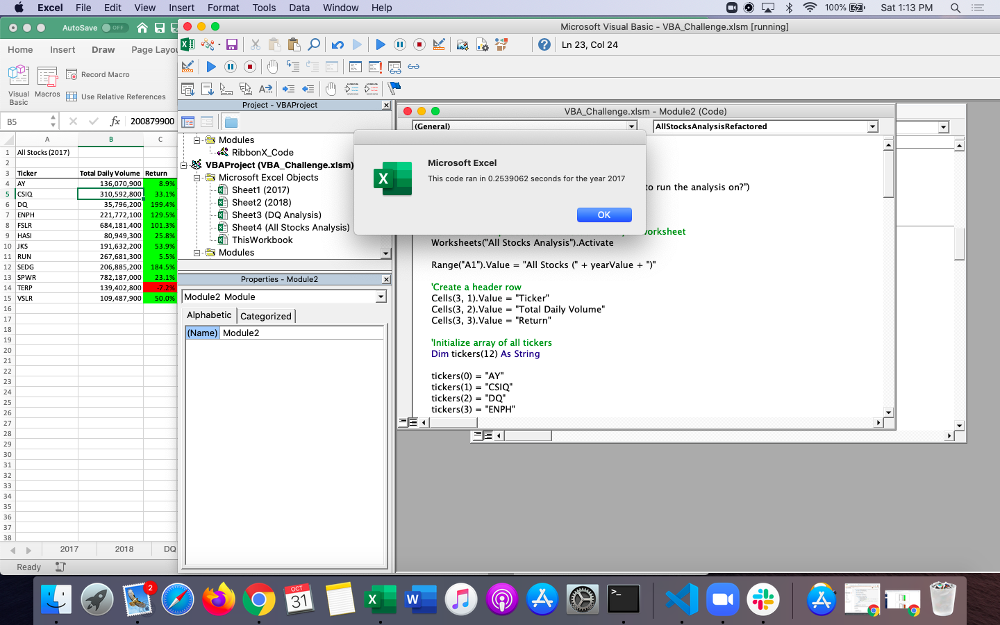
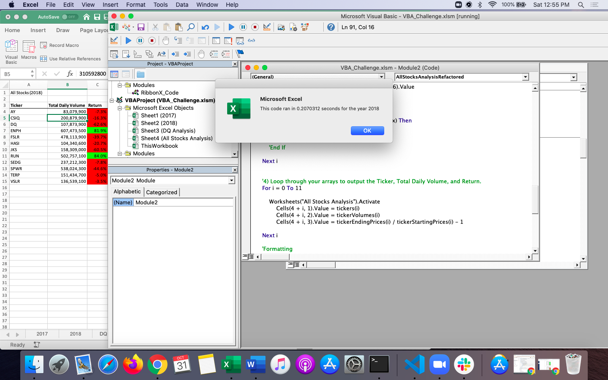

# **Stock-Analysis**
## Excel and VBA

## **Overview of Project**

The purpose of this analysis is to provide Steve with a macro enabled workbook that is able to run through as many stocks as he needs quickly and without over-utilizing computer memory. This analysis will provide results in a faster time frame by refactoring the existing workbook created throughout the module.

## **Results**
    "Using images and examples of your code, compare the stock performance between 2017 and 2018, as well as the execution times of the original script and the refactored script." 

By creating a tickerIndex we create a variable (integer) that is able to increase as it moves between the four arrays (including "tickers"). By doing so, the tickerIndex will compile the data for the outputs "Ticker Name, Total Volume and Return" for each of the stocks in the 2017 and 2018 datasets. 

    Dim tickerIndex As Integer
    tickerIndex = 0

    If Cells(i + 1, 1).Value <> tickers(tickerIndex) Then
             tickerIndex = tickerIndex + 1
            
          End If

The reduction of time is driven by only having to loop through the entire code one time as opposed to the three times that the VBA is looping through the original code.

### **2017 Stock Performance** ###
In 2017, most of the stocks we are looking at had an increase, with the exception of TERP which experienced a decrease of -7.2% for the year.

Original Execution time: 0.7148438 seconds

Refactored Execution time (2017): 0.2539062 seconds
 </img>

### **2018 Stock Performance** ###
In 2018, the stocks in our analysis had a tougher time, wih only ENPH and RUN having a positive return. (If we were doing a further investigation, perhaps there is another variable that influenced the return of green stocks that year.)

Original Execution time: 0.7148438

Refactored Execution time (2018): 0.2070312 seconds
 </img>

## **Summary**

 **1. What are the advantages or disadvantages of refactoring code?**

   ### *Advantages* ###
   The main advantage to refactoring code is that it will take fewer of the computer's resources to run it. It will also generate the output faster and can be adapted to take on larger amounts of data more efficiently without compromising the effectiveness of the code.

   ### *Disadvantages* ###
   The main disadvantage is that it is time consuming to edit the code that has already been written. Another disadvantage is that it is possible to break the code by refactoring it and more time will be spent fixing it.

**2. How do these pros and cons apply to refactoring the original VBA script?**

### *Advantages* ###
  The advantages of refactoring in general pertain to this VBA script. It runs much faster than the original script did. By reducing the amount of times the code loops through the data, we are able to reduce the overall timer by over 66%! 
  If we were to increase the amount of tickers in this data set, we would be able to with minimal amount of adjusting.

### *Disadvantages* ###
The disadvantages of refactoring in general pertains to this script as well. It took as long for me to refactor the script as it did for me to build it by coding along with the modules. There were many instances where I broke the code by making an adjustment and then had to go back and fix it. 